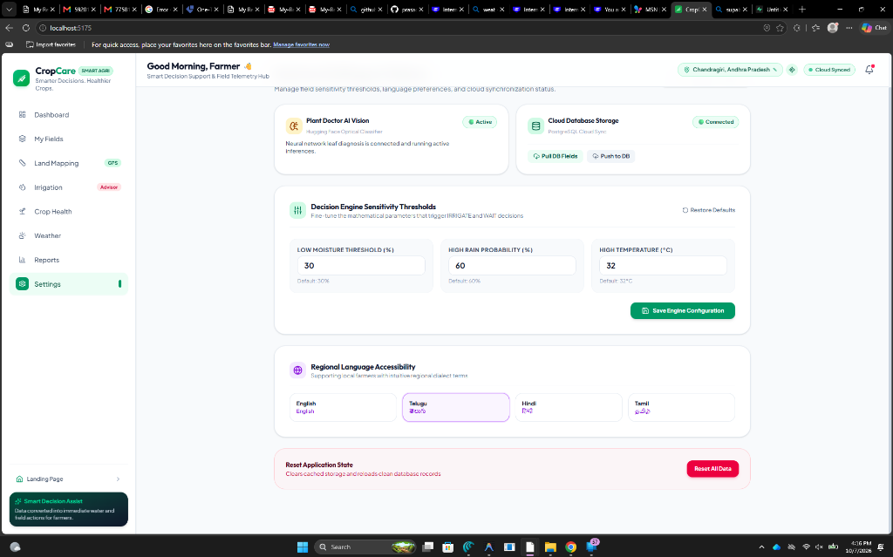
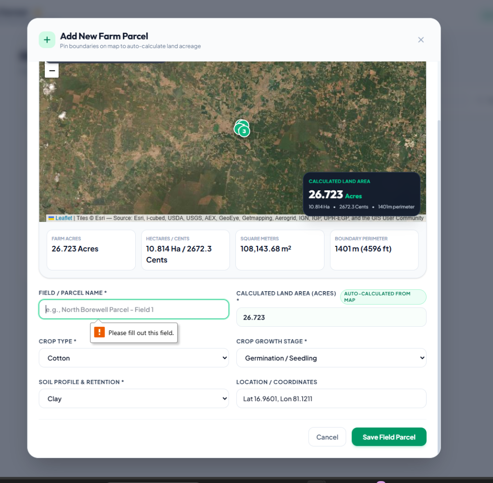
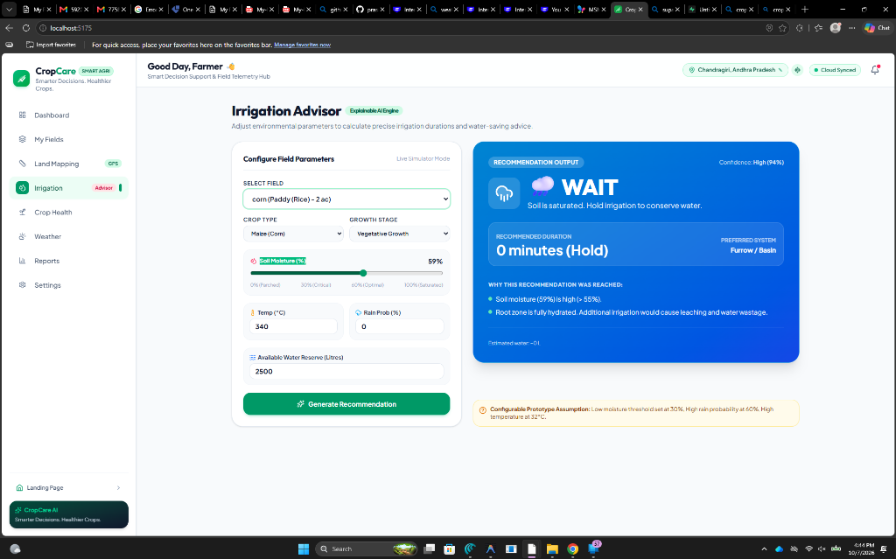
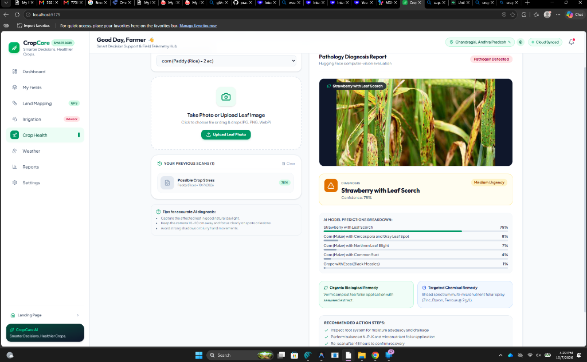
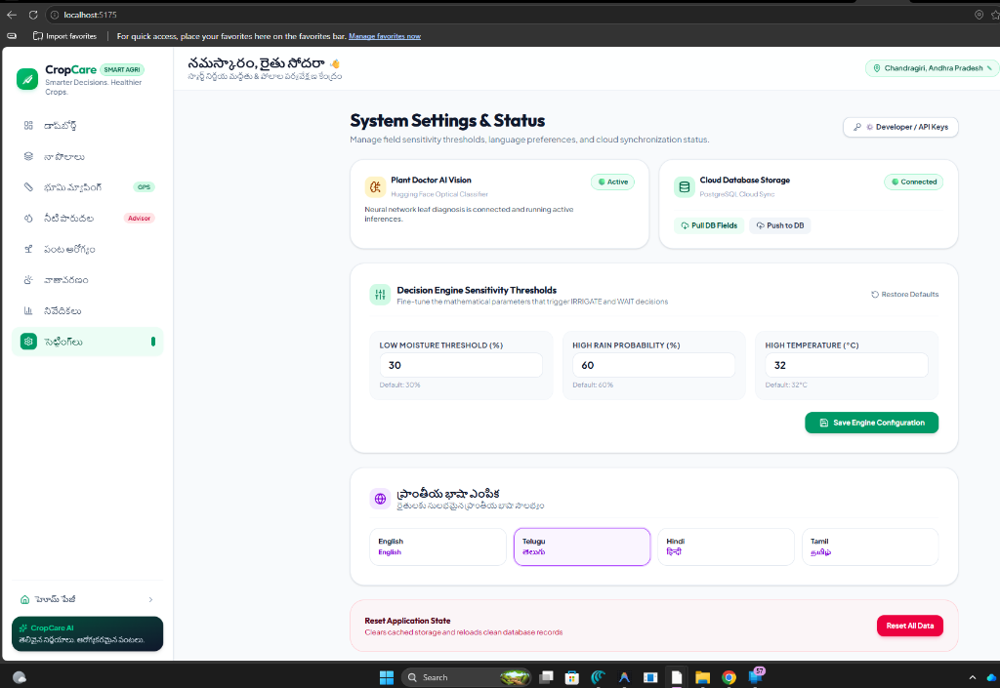
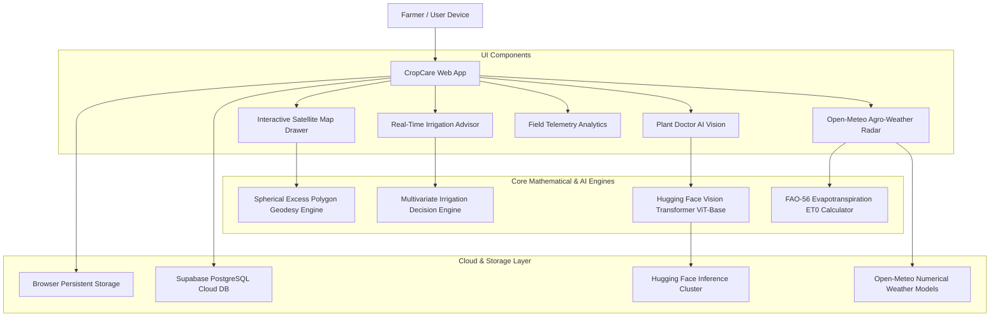

# 🌾 CropCare — Smart Farming Decision Support & Field Telemetry System

> **Autonomous Agronomic Decision Engine, GPS Polygon Land Geodesy, and Vision Transformer (ViT) Plant Pathology for Precision Agriculture.**

---

## 📸 Application Feature Showcase & Screenshots

### 1. 📊 Smart Dashboard & Autonomous Decision Hub
*Real-time agronomic telemetry, daily smart action shortcuts, soil moisture status gauges, and today's explainable irrigation advisory card.*



---

### 2. 🗺️ Satellite Land Mapping & GPS Acreage Calculator
*High-resolution ESRI / OpenStreetMap satellite canvas with draggable boundary pins, GPS auto-centering, and instant spherical excess land area measurement (Acres, Hectares, Cents, Gunthas, Perimeter).*



---

### 3. 💧 Real-Time Reactive Irrigation Advisor
*Live decision simulator calculating precise irrigation run duration (minutes), preferred delivery method (Drip / Sprinkler / Furrow), and estimated water volume saved.*



---

### 4. 🔬 Plant Doctor — Hugging Face AI Vision Leaf Diagnosis
*Google Vision Transformer (ViT-Base) computer-vision leaf pathology with multi-head self-attention, foliar spot analysis, biological remedies, and targeted chemical dosages.*



---

### 5. 🌐 Regional Language Accessibility & System Status
*Instant localized dialect switching across Telugu (తెలుగు), Hindi (हिन्दी), Tamil (தமிழ்), and English with cloud database sync.*



---

## 📋 Table of Contents
1. [Executive Overview](#-executive-overview)
2. [Application Feature Showcase](#-application-feature-showcase--screenshots)
3. [System Architecture](#-system-architecture)
4. [Mathematical Algorithms & Formulas](#-mathematical-algorithms--formulas)
   - [A. Geodesic Land Area & Perimeter Algorithm (GPS Geodesy)](#a-geodesic-land-area--perimeter-algorithm-gps-geodesy)
   - [B. Explainable Irrigation Decision Engine](#b-explainable-irrigation-decision-engine)
   - [C. FAO-56 Penman-Monteith Evapotranspiration ($ET_0$) & Spraying Index](#c-fao-56-penman-monteith-evapotranspiration-et_0--spraying-index)
5. [Machine Learning & AI Vision Architecture](#-machine-learning--ai-vision-architecture)
   - [Google Vision Transformer (ViT-Base) Model](#google-vision-transformer-vit-base-model)
   - [Crop-Aware Agronomic Pathogen Taxonomy](#crop-aware-agronomic-pathogen-taxonomy)
6. [Codebase Function & Module Inventory](#-codebase-function--module-inventory)
7. [Internationalization & Regional Languages](#-internationalization--regional-languages)
8. [Installation & Setup Guide](#-installation--setup-guide)
9. [Environment Variables](#-environment-variables)

---

## 🌟 Executive Overview

**CropCare** is a full-stack smart agriculture assistant designed to empower farmers with real-time field telemetry, satellite land boundary mapping, scientific irrigation advice, and computer-vision plant pathology.

- **Frontend & Core**: React 18, TypeScript, Tailwind CSS, Leaflet / ESRI Satellite Maps, Lucide Icons, Canvas Confetti, Recharts.
- **AI Vision Engine**: Google Vision Transformer (ViT-Base) fine-tuned on plant pathology (`dima806/plant_disease_detection` via Hugging Face Inference API) with Crop-Context Validation.
- **Weather Telemetry**: Open-Meteo High-Resolution Agricultural Forecasting API with real-time reverse geocoding.
- **Database & Sync**: Supabase PostgreSQL with real-time browser `localStorage` caching and fallback offline synchronization.

---

## 🏗️ System Architecture



---

## 📐 Mathematical Algorithms & Formulas

### A. Geodesic Land Area & Perimeter Algorithm (GPS Geodesy)
Located in [`src/utils/geoAreaCalculator.ts`](file:///d:/cropcare/src/utils/geoAreaCalculator.ts).

Farm boundaries drawn on Leaflet maps are evaluated over the Earth's curved ellipsoidal surface (**WGS84 Reference Ellipsoid**, mean radius $R = 6,378,137\text{ meters}$).

#### 1. Spherical Polygon Area (Gauss's Divergence / Spherical Excess)
For a closed polygon defined by $n$ coordinate vertices $[(\phi_1, \lambda_1), (\phi_2, \lambda_2), \dots, (\phi_n, \lambda_n)]$ where $\phi$ is latitude and $\lambda$ is longitude in radians:

$$\Delta\lambda_i = \lambda_{i+1} - \lambda_i$$

$$E = \sum_{i=1}^{n} \Delta\lambda_i \cdot \left( 2 + \sin\phi_i + \sin\phi_{i+1} \right)$$

$$\text{Area } (m^2) = \frac{R^2 \cdot |E|}{2}$$

#### 2. Great Circle Boundary Perimeter (Haversine Formula)
Between any two adjacent vertices $P_1(\phi_1, \lambda_1)$ and $P_2(\phi_2, \lambda_2)$:

$$\Delta\phi = \phi_2 - \phi_1, \quad \Delta\lambda = \lambda_2 - \lambda_1$$

$$a = \sin^2\left(\frac{\Delta\phi}{2}\right) + \cos\phi_1 \cdot \cos\phi_2 \cdot \sin^2\left(\frac{\Delta\lambda}{2}\right)$$

$$c = 2 \cdot \text{atan2}\left(\sqrt{a}, \sqrt{1 - a}\right)$$

$$\text{Distance } d_i = R \cdot c$$

$$\text{Total Perimeter } (m) = \sum_{i=1}^{n} d_i$$

#### 3. Regional Agricultural Unit Conversions
$$\text{Acres} = \frac{\text{Area } (m^2)}{4046.8564224}$$

$$\text{Hectares} = \frac{\text{Area } (m^2)}{10000}$$

$$\text{Cents} = \text{Acres} \times 100 \quad (1\text{ Acre} = 100\text{ Cents})$$

$$\text{Gunthas} = \text{Acres} \times 40 \quad (1\text{ Acre} = 40\text{ Gunthas})$$

$$\text{Square Feet} = \text{Area } (m^2) \times 10.7639$$

$$\text{Perimeter Feet} = \text{Perimeter } (m) \times 3.28084$$

#### 4. Centroid Coordinates
$$\phi_{\text{center}} = \frac{1}{n}\sum_{i=1}^{n} \phi_i, \quad \lambda_{\text{center}} = \frac{1}{n}\sum_{i=1}^{n} \lambda_i$$

---

### B. Explainable Irrigation Decision Engine
Located in [`src/engine/irrigationEngine.ts`](file:///d:/cropcare/src/engine/irrigationEngine.ts).

The decision engine applies multivariate agronomic evaluations to determine whether a field parcel requires watering, holding, or prioritization.

#### 1. Input Parameters
- **Soil Moisture ($M$)**: Measured in $\%$.
- **Ambient Temperature ($T$)**: Measured in $^\circ\text{C}$.
- **Rain Probability ($P_{\text{rain}}$)**: Measured in $\%$.
- **Crop Water Demand Factor ($K_c$)**:
  - Paddy (Rice): $1.35$
  - Sugarcane: $1.25$
  - Tomato: $1.15$
  - Chilli: $1.10$
  - Maize (Corn): $1.00$
  - Cotton: $0.95$
  - Wheat: $0.90$
  - Groundnut (Peanut): $0.85$
- **Crop Growth Stage Sensitivity ($W_{\text{stage}}$)**:
  - Flowering / Tillering: $1.40$ (Critical reproductive moisture window)
  - Grain / Pod Formation: $1.30$ (Yield formation window)
  - Germination / Seedling: $1.10$ (Delicate shallow roots)
  - Vegetative Growth: $1.00$ (Active canopy growth)
  - Ripening / Maturity: $0.60$ (Dry-down phase before harvest)
- **Soil Drainage Factor ($D_{\text{soil}}$)**:
  - Sandy Loam: $1.30$ (Rapid percolation)
  - Red Sandy Loam: $1.15$
  - Loamy / Alluvial: $1.00$
  - Black Cotton Soil: $0.90$ (High water retention)
  - Clay: $0.85$ (Slow infiltration)

#### 2. Decision Logic Matrix
| Condition | Trigger Thresholds | Output Decision | Action Summary |
| :--- | :--- | :--- | :--- |
| **Critically Dry** | $M < 30\%$ and $P_{\text{rain}} < 60\%$ and Water $> 2000\text{L}$ | **`IRRIGATE`** | Run targeted duration via preferred delivery method |
| **Constrained Water** | $M < 30\%$ and $P_{\text{rain}} < 60\%$ and Water $\le 2000\text{L}$ | **`PRIORITIZE`** | High-priority rationed run to prevent permanent wilting |
| **Impending Rain** | $M < 30\%$ and $P_{\text{rain}} \ge 60\%$ | **`WAIT`** | Hold irrigation; impending rain will hydrate root zone |
| **Adequate Moisture** | $31\% \le M \le 55\%$ | **`MONITOR`** | Moisture is optimal; no irrigation needed today |
| **Saturated Soil** | $M > 55\%$ | **`WAIT`** | Soil saturated; hold to prevent root rot and nutrient leaching |

#### 3. Run Duration Equation (Minutes)
For decisions evaluating to `IRRIGATE` or `PRIORITIZE`:

$$\text{Deficit} = \max(0, 50 - M)$$

$$\text{Base Duration} = \left( \text{Deficit} \times 0.45 + 10 \right) \times \sqrt{\text{Area}} \times K_c \times W_{\text{stage}} \times D_{\text{soil}}$$

$$\text{Min Duration} = \max(10, \text{round}(\text{Base Duration} \times 0.9))$$

$$\text{Max Duration} = \max(15, \text{round}(\text{Base Duration} \times 1.1))$$

#### 4. Estimated Water Required & Water Saved
$$\text{Water Required (L)} = \text{Base Duration} \times (120 \times \text{Area})$$

$$\text{Water Saved (L)} = \begin{cases} 
\text{round}(20 \times 120 \times \text{Area} \times 1.2) & \text{if } \text{Decision} = \text{WAIT} \\
\max(200, \text{round}((45 - \text{Base Duration}) \times 120 \times \text{Area} \times 0.5)) & \text{if } \text{Decision} = \text{IRRIGATE} \\
\text{round}(15 \times 120 \times \text{Area} \times 0.8) & \text{if } \text{Decision} = \text{MONITOR}
\end{cases}$$

---

### C. FAO-56 Penman-Monteith Evapotranspiration ($ET_0$) & Spraying Index
Located in [`src/services/weatherService.ts`](file:///d:/cropcare/src/services/weatherService.ts).

- **Reference Evapotranspiration ($ET_0$)**: Fetched directly from the Open-Meteo agro-meteorology API in $\text{mm/day}$ based on solar radiation, temperature, air humidity, and wind speed at 2m height.
- **Pesticide Spray Safety Rule**:
  $$\text{Safe to Spray} = (\text{Wind Speed} < 15\text{ km/h}) \land (P_{\text{rain}} < 30\%) \land (T < 35^\circ\text{C})$$

---

## 🧠 Machine Learning & AI Vision Architecture

### Google Vision Transformer (ViT-Base) Model
Located in [`src/services/huggingfaceService.ts`](file:///d:/cropcare/src/services/huggingfaceService.ts).

- **Model ID**: `dima806/plant_disease_detection`
- **Architecture**: **Vision Transformer (ViT-Base-Patch16-224)**
- **Inference Mode**: Direct binary octet-stream POST to Hugging Face Inference Routers (`https://router.huggingface.co/hf-inference/models/dima806/plant_disease_detection`).
- **Input Resolution**: $224 \times 224$ RGB normalized image tensor.
- **Attention Mechanism**: Multi-Head Self-Attention over $16 \times 16$ pixel patches to capture subtle foliar necrosis, chlorosis, and fungal spore halos across leaf surfaces.

### Crop-Aware Agronomic Pathogen Taxonomy
The system validates classification labels against the target field's crop to eliminate cross-species false positives:

| Crop | Verified Pathogen | Symptoms | Organic Biological Remedy | Targeted Chemical Remedy |
| :--- | :--- | :--- | :--- | :--- |
| **Paddy (Rice)** | **Brown Spot** (*Bipolaris oryzae*) | Oval/circular dark brown spots with yellow halos | *Pseudomonas fluorescens* (5g/L) + Neem seed kernel extract (5%) | Propiconazole 25% EC @ 1 ml/L or Hexaconazole 5% EC @ 2 ml/L |
| **Paddy (Rice)** | **Leaf Blast** (*Magnaporthe oryzae*) | Spindle/eye-shaped lesions with grey centers | *Trichoderma viride* (5g/L) + Panchagavya (3%) | Tricyclazole 75% WP @ 0.6 g/L or Kasugamycin 3% SL @ 2.5 ml/L |
| **Paddy (Rice)** | **Bacterial Leaf Blight** (*Xanthomonas oryzae*) | Water-soaked to yellowish-white wavy margins | Cow dung slurry filtrate (10%) + fermented buttermilk | Streptocycline (1g/10L) + Copper Oxychloride 50% WP @ 2.5 g/L |
| **Maize (Corn)** | **Gray Leaf Spot** (*Cercospora zeae-maydis*) | Rectangular lesions bounded by veins | *Pseudomonas fluorescens* (0.5%) + Seaweed extract | Azoxystrobin 18.2% + Difenoconazole 11.4% SC @ 1 ml/L |
| **Maize (Corn)** | **Common Rust** (*Puccinia sorghi*) | Reddish-brown powdery pustules | Neem oil 10,000 ppm @ 3 ml/L + Baking soda (1g/L) | Mancozeb 75% WP @ 2.5 g/L or Tebuconazole 25.9% EC @ 1.5 ml/L |
| **Groundnut** | **Tikka Disease** (*Cercospora arachidicola*) | Circular reddish-brown spots with yellow halos | 5% Neem seed kernel extract + fermented curd | Chlorothalonil 75% WP @ 2g/L or Hexaconazole 5% SC @ 2ml/L |
| **Cotton** | **Bacterial Blight** (*Xanthomonas*) | Angular water-soaked lesions on leaf veins | *Pseudomonas fluorescens* @ 5g/L foliar spray | Copper Oxychloride 50% WP @ 3g/L + Streptocycline @ 1g/10L |

---

## 📂 Codebase Function & Module Inventory

| File Path | Description & Primary Functions |
| :--- | :--- |
| [`src/utils/geoAreaCalculator.ts`](file:///d:/cropcare/src/utils/geoAreaCalculator.ts) | • `calculatePolygonArea(coords)`: Computes geodesic area ($m^2$, Acres, Hectares, Cents, Gunthas, Sq Ft) and perimeter using WGS84 spherical excess.<br>• `toRadians(deg)`: Converts degrees to radians. |
| [`src/engine/irrigationEngine.ts`](file:///d:/cropcare/src/engine/irrigationEngine.ts) | • `runIrrigationEngine(input)`: Executes explainable multi-factor irrigation recommendation logic.<br>• `DEFAULT_THRESHOLDS`: Baseline agronomic thresholds. |
| [`src/services/huggingfaceService.ts`](file:///d:/cropcare/src/services/huggingfaceService.ts) | • `analyzeCropWithHuggingFace(imageBlob, crop)`: Sends leaf image to Hugging Face ViT model with fallback.<br>• `getHuggingFaceConfig()` / `saveHuggingFaceConfig()`: Reads and updates API credentials. |
| [`src/services/weatherService.ts`](file:///d:/cropcare/src/services/weatherService.ts) | • `fetchWeatherData(lat, lon, name)`: Fetches Open-Meteo live solar radiation, humidity, rain probability, and $ET_0$.<br>• `reverseGeocodeLocation(lat, lon)`: Converts GPS coordinates to village/district name.<br>• `searchGeocodingLocations(query)`: Autocompletes village names. |
| [`src/services/storageService.ts`](file:///d:/cropcare/src/services/storageService.ts) | • `getFields()`, `saveField()`, `deleteField()`: Manages farm parcels.<br>• `getLogs()`, `addLog()`: Records irrigation runs.<br>• `getScans()`, `addScan()`: Records leaf pathology diagnoses.<br>• `syncFromSupabase()`, `pushLocalFieldsToSupabase()`: Cloud Postgres synchronization. |
| [`src/services/supabase.ts`](file:///d:/cropcare/src/services/supabase.ts) | • `getSupabaseClient()`: Initializes Supabase JS client.<br>• `testSupabaseConnection()`: Verifies PostgreSQL connection credentials. |
| [`src/i18n/translations.ts`](file:///d:/cropcare/src/i18n/translations.ts) | Master translation dictionary for English (`en`), Telugu (`te`), Hindi (`hi`), and Tamil (`ta`). |
| [`src/i18n/LanguageContext.tsx`](file:///d:/cropcare/src/i18n/LanguageContext.tsx) | React Context Provider and `useLanguage()` hook for regional dialect switching. |
| [`src/components/FarmMapDrawer.tsx`](file:///d:/cropcare/src/components/FarmMapDrawer.tsx) | Interactive Leaflet satellite map with draggable pins, polygon fill, GPS live-location centering, and ESRI World Imagery layer. |
| [`src/components/Header.tsx`](file:///d:/cropcare/src/components/Header.tsx) | App header with live GPS reverse geocoder, database status indicator, and dynamic real-time field telemetry alerts. |
| [`src/views/DashboardView.tsx`](file:///d:/cropcare/src/views/DashboardView.tsx) | Main dashboard showing today's recommendation hero card, soil moisture gauges, active field switcher, and weather summary. |
| [`src/views/CropHealthView.tsx`](file:///d:/cropcare/src/views/CropHealthView.tsx) | Plant Doctor UI with leaf dropzone, scanner laser animation, ViT diagnosis breakdown, and remedies. |
| [`src/views/IrrigationAdvisorView.tsx`](file:///d:/cropcare/src/views/IrrigationAdvisorView.tsx) | Live reactive simulator with moisture sliders, temperature inputs, run duration calculation, and confetti cycle execution. |
| [`src/views/LandMappingView.tsx`](file:///d:/cropcare/src/views/LandMappingView.tsx) | Farm boundary pin mapping canvas with acreage cards and step-by-step surveying guide. |
| [`src/views/WeatherView.tsx`](file:///d:/cropcare/src/views/WeatherView.tsx) | 7-day agricultural weather radar with hourly moisture curves, wind vectors, and pesticide spray advisor. |
| [`src/views/ReportsView.tsx`](file:///d:/cropcare/src/views/ReportsView.tsx) | Telemetry analytics charts with 7-day soil moisture progression trends and CSV export. |
| [`src/views/SettingsView.tsx`](file:///d:/cropcare/src/views/SettingsView.tsx) | System status overview, Supabase DB sync, regional language selector, and factory reset. |

---

## 🌐 Internationalization & Regional Languages

CropCare is fully internationalized across **4 languages**:
1. **Telugu (తెలుగు)**: Localized for farmers in Andhra Pradesh and Telangana (e.g., *భూమి మ్యాపింగ్*, *నీటి పారుదల*, *పంట ఆరోగ్యం*, *వాతావరణం*).
2. **Hindi (हिन्दी)**: Localized for farmers across northern and central India (e.g., *भूमि मैपिंग*, *सिंचाई सलाहकार*, *फसल स्वास्थ्य*).
3. **Tamil (தமிழ்)**: Localized for farmers in Tamil Nadu (e.g., *நில வரைபடம்*, *பாசன ஆலோசகர்*, *பயிர் நலம்*).
4. **English**: Standard international agronomy terms.

Language preference is persisted locally in `cropcare_app_lang_v1`.

---

## 🚀 Installation & Setup Guide

### 1. Prerequisites
- **Node.js** (v18.0.0 or higher)
- **npm** (v9.0.0 or higher)

### 2. Clone and Install Dependencies
```bash
git clone https://github.com/your-username/cropcare.git
cd cropcare
npm install
```

### 3. Run Development Server
```bash
npm run dev
```
Open your browser at `http://localhost:5173/`.

### 4. Build for Production
```bash
npm run build
```
Generates production-ready, minified static bundles in `dist/`.

---

## 🔐 Environment Variables

Create a `.env` file in the root directory (refer to [`.env.example`](file:///d:/cropcare/.env.example)):

```env
# 1. Supabase Postgres Database Configuration
VITE_SUPABASE_URL=https://your-project-id.supabase.co
VITE_SUPABASE_ANON_KEY=your-anon-public-key-here

# 2. Hugging Face AI Vision Model (Plant Disease Identification)
VITE_HUGGINGFACE_API_KEY=hf_your_token_here
VITE_HUGGINGFACE_MODEL=dima806/plant_disease_detection
```

---

## 📄 License
This project is licensed under the **MIT License**.
